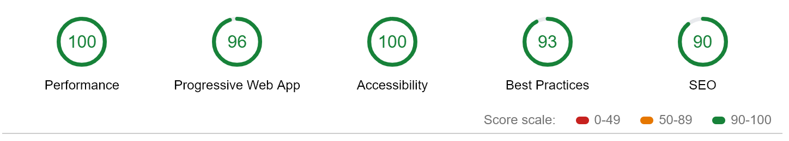
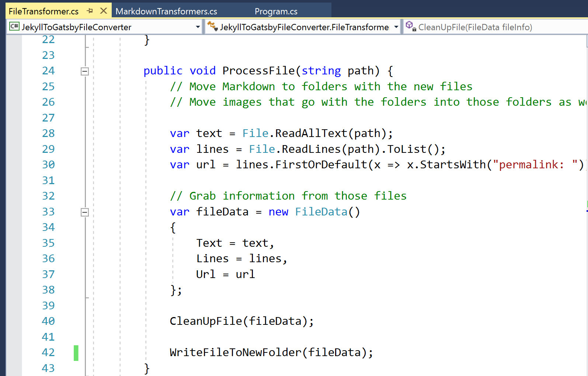

You may have noticed my site design has become a bit... sparse. That's because I recently moved from a hosted WordPress solution to a static built on Gatsby.js. While it's less fancy on the outside, I'm thrilled about my new site's performance, accessability, and security.

## Why Move?

I've been on WordPress for a few years now, spending about $20/month on a specialized WordPress hosting solution. I didn't want to spend time managing a WordPress install, so I opted for the pricey (for my level of traffic) option. I added a few plugins and a purchased theme and I was off to the races. Even though this solution worked, I didn't care for the performance or the difficulty of customization. Even though my site was low traffic on specialized hosting, it still took a few seconds for it to load up, especially on my phone. I also had trouble loading the site when I was behind my VPN. 

I've known about static site generators for a while and tried a few of them out, but I never found one that I liked until I learned about Gatsby.js. Gatsby makes it easy to build whatever kind of website you want. It's React based, so if you're used to using React, Gatsby.js will seem easy. Even if you're not, their website has an easy to follow tutorial to get you up and running. 

The first thing you notice when using Gatsby is that it's freaky fast, even on lousy web connections. Pages load nearly instantaneously. 

Here's my Lighthouse Score in Chrome Tools:

Another advantage static sites have over WordPress is that they are far more secure. It's hard to hack a handful of static pages hanging out on a server. WordPress, on the other hand, is a huge target that has tons of security vulnerabilities and requires constant updating.

Finally, because it's a static site, you can host it on the cheap. There's tons of inexpensive static hosts including Azure Static Sites, AWS S3, and my personal favorite, Netlify. I'll happily save 240 bucks a year. While price is not my primary consideration, when it's cheaper *and* better, it's hard to resist.

## Migration

Migrating a blog from an old format to a new one can be a real pain. One of the problems with moving to a custom solution is that you need a custom migration tool. Most Gatsby blogs work by taking a folder of Markdown and converting it into a list of web pages. While there's not a specific tool to move me to Gatsby there is a tool to generate Jekyll Markdown files. 

[Jekyll Export Tool](https://github.com/benbalter/wordpress-to-jekyll-exporter)

This tool did a great job of turning my WordPress posts into a series of Markdown files, but it still wasn't the format my blog needed. There was also a lot of garbage in some of the files. I could manually setup each file, but I'm a lazy developer, so I wrote a throwaway .NET Core Console App to do it for me. The nice thing about this is that I could incrementally add in steps without having to backtrack on my changes.

After I had that setup, I used Netlify to host my site. All you need to do is point it at a Git repo and it'll build automatically from that repository. With a little bit of extra setup you can even create a QA branch to test your changes before they go live. The initial setup takes about five minutes, and then you need another couple of hours to get your domain moved over, but most of those hours are waiting for the DNS servers to propagate the update.

## The Future

I plan on continuing to tweak the site layout as time goes on. I also want to continue to learn more about Gatsby and use it on more side projects. If you want to setup your own Gatsby blog, I wrote a more detailed guide on Medium. Check it out and enjoy your new site.

[Setup Your Own Blog](https://medium.com/that-conference/the-cheap-and-easy-way-to-setup-a-developer-blog-a8423079df8b)